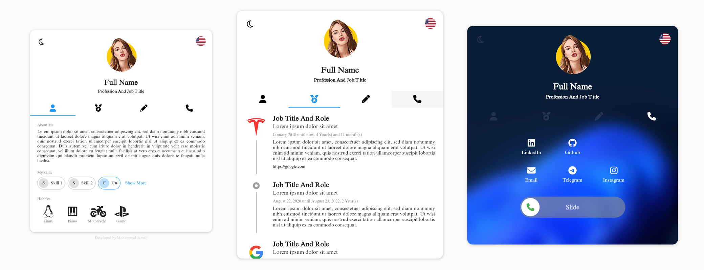
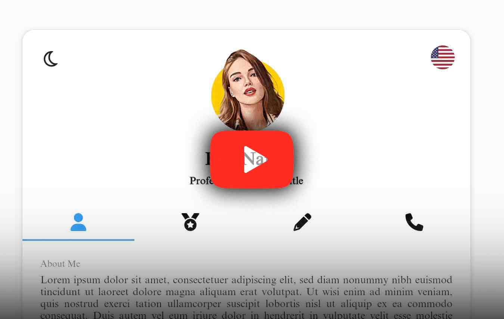

# Flutter Resume Website


This repository contains the release build of a flutter project that was developed by me to demonstrate my resume and portfolio information publicly on the web.

But because I love to see people using my products for themself, I decided to share this project with all and publicly available forever.

To use it, simply clone the repository and edit the file `assets/assets/resume.json` and all the images and publish it to your hosting service. But please consider giving this project a star if you are using it.

[](https://youtube.com/shorts/LzlUg5g0p2g?feature=share)

The structure of the JSON data source is as easy as you see. you have the option to provide your data using two different languages, Persian and English.

If you set `"supportDeveloper"` to true, my name will be shown at the bottom of the page.

By looking at the class models below, you can understand the structure of the JSON data source.

```
class Datasource {
  final String language;
  final bool supportDeveloper;
  final AboutMeModel aboutMe;
  final BlogModel? blog;
  final List<TimelineModel> timeline;
  final List<ContactModel> contacts;
}

class BlogModel {
  final List<BlogPostModel>? blogPosts;
  final String? mediumRssLink;
}

class BlogPostModel {
  final String title;
  final DateTime publishedDate;

  final int? iconCode;
  final IconClass? iconClass;

  final String? imgUrl;
  final String? description;
  final String? externalLink;
  final DetailModel? detail;
}

class TimelineModel {
  final String title;
  final String description;
  final String? image;
  final String? externalLink;
  final String? caption;
  final String? subtitle;
  final DateTime? startedAt;
  final DateTime? finishedAt;
  final DetailModel? detail;

  final int? color;
  final int? iconCode;
  final IconClass? iconClass;
}

class AboutMeModel {
  final String profilePic;
  final String fullname;
  final String slogan;
  final String biography;
  final int topSkills;
  final List<TagModel>? skills;
  final List<HobbyModel>? hobbies;
}

class TagModel {
  final String tag;
  final DetailModel? detail;
}

class HobbyModel {
  final String? title;
  final int iconCode;
  final IconClass iconClass;
  final DetailModel? detail;
}

class DetailModel {
  final String title;
  final List<IconTagModel> tags;
  final List<Map<String, dynamic>> document;
}

class IconTagModel {
  final String title;
  final String value;
  final int iconCode;
  final IconClass iconClass;
}

class ContactModel {
  final ContactHost host;
  final String identifier;
}

enum ContactHost {
  phone,
  sms,
  email,
  facebook,
  instagram,
  telegram,
  whatsapp,
  skype,
  pinterest,
  twitter,
  twitch,
  viber,
  youtube,
  linkedIn,
  medium,
  github,
  gitlab,
  bitbucket,
}

enum IconClass {
  iconDataSolid,
  iconDataBrands,
  iconDataRegular,
  materialIcon,
}

```

Two Things:

* The `DetailModel.detail` can be simply generated on this site: `https://quilljs.com/docs/delta/`

* The `iconCode` and `iconClass` can be derived from the `https://fontawesome.com/icons` website.

* Please take care of the capital and noncapital cases words for enumerations